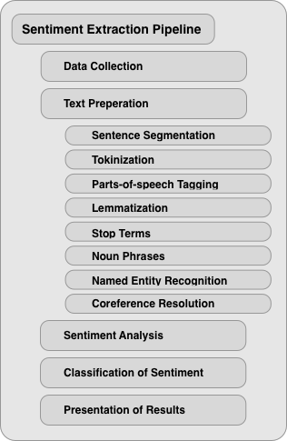

### **Short Description**

The purpose of this study is to evaluate the most prevalent techniques of natural language processing (NLP) in terms of their advantages and disadvantages for financial sentiment analysis (FSA), as well as to determine whether machine-learning-based approaches to sentiment measurement outperform those that rely on human perception of linguistic features. Additionally, I will outline the differences between these various sentiment analysis techniques by exemplarily showing their application in the financial context to subsequently compare their forecasting performance. To do so, I will use a dataset of messages sent via the online social media website StockTwits as well as a dataset of news headlines. I discover that Machine Learning (ML) improves sentiment classification performance substantially.

### **Data Sets**

    

         StockTwits Data Set - Word Cloud</img>
    

    

         News Headlines Data Set - Word Cloud</img>
    

### **Processing Pipeline**
</img>

### **Results**
#### **Dictionaries**
#### <u>Harvard-IV</u>

    

        </img>
        StockTwits - Harvard-IV - Confusion Matrix
    

    

        </img>
        News Headlines - Harvard-IV - Confusion Matrix
    

#### <u>Loughran and McDonald</u>

    

         StockTwits - Loughran and McDonald - Confusion Matrix</img>
    

    

         News Headlines - Loughran and McDonald - Confusion Matrix</img>
    

#### **Machine Learning**
#### <u>Naive Bayes</u>

    

         StockTwits - Naive Bayes - Confusion Matrix</img>
    

    

         News Headlines - Naive Bayes - Confusion Matrix</img>
    

#### <u>Support Vector Machine</u>

    

         StockTwits - Support Vector Machine - Confusion Matrix</img>
    

    

         News Headlines - Support Vector Machine - Confusion Matrix</img>
    

#### <u>Logistic Regression</u>

    

         StockTwits - Logistic Regression - Confusion Matrix</img>
    

    

         News Headlines - Logistic Regression - Confusion Matrix</img>
    

#### <u>Multilayer Perceptron</u>

    

         StockTwits - Multilayer Perceptron - Confusion Matrix</img>
    

    

         News Headlines - Multilayer Perceptron - Confusion Matrix</img>
    

<h3>#### <u>Neural Network</u> </h3>
    

         StockTwits - Neural Network - Confusion Matrix</img>
    

    

         News Headlines - Neural Network - Confusion Matrix</img>
    

<svg fill="none" viewBox="0 0 400 400" width="400" height="400" xmlns="http://www.w3.org/2000/svg">
    <foreignObject width="100%" height="100%">
        

            
        

    </foreignObject>
</svg>